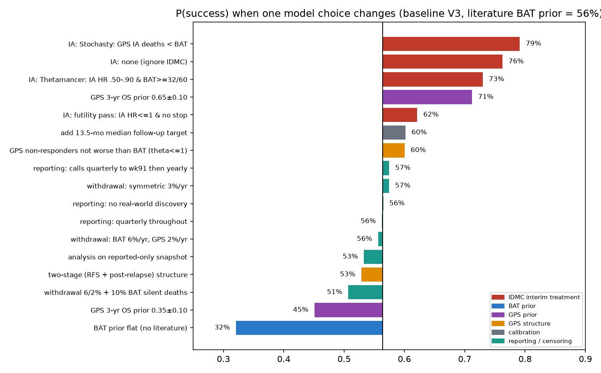

# REGAL: additional model choices from the community, and what they do to the answer

Scope of the read: all 35 submissions and 100 most recent comments I could recover for u/Confident-Web-7118 (CW), plus about 45 posts and several comment threads from roughly 30 other r/sellaslifesciences users (modellers, BAT-literature threads, bear cases, censoring threads). Not read: tables embedded as images, the Discord, Stocktwits (LeftyMD), the subreddit wiki (blocked), and any post missing from the PullPush archive. Many posts say they were built with an LLM or lean on unverified correspondence, so I treat them as claims, not data. Several authors (CW included) disclose large long positions.

Code: `regal_model_v2.py`, `run_v2.py`, `run_v2b.py`, `analyze_v2.py`, `figures_v2.py`. Results: `results_v2/` (`table_scenarios.csv`, `table_ia_variants.csv`, `table_theta.csv`, `tornado.csv`, `fig_tornado_v2.png`).

## 1. Result in one picture

Baseline = v1 base case in v2 form (protocol call schedule + 50% real-world discovery, literature BAT prior, flat GPS prior, interim "no efficacy stop"): **P(success) 56%**.

**Ranking of what moves the answer** (percentage points from 56%):

| Choice | P(success) | Move |
|---|---|---|
| BAT prior flat instead of literature | 32% | −24 |
| GPS 3-yr OS prior 0.35 / 0.65 | 45% / 71% | −11 / +15 |
| How the IDMC interim is used (none / futility-only / Stochasty / Thetamancer) | 76% / 62% / 79% / 73% | +6 to +23 |
| GPS non-responders may be worse than BAT (v2) vs not (v1) | 56% vs 60% | −4 |
| Add the 13.5-month median follow-up target | 60% | +4 |
| Two-stage structure (relapse-free, then post-relapse) | 53% (small effective sample, 131) | −3 |
| Reporting lag variants (schedule, real-world discovery) | 56–58% | ±1 |
| Withdrawal / loss to follow-up (BAT 6%, GPS 2% per year) | 56% | 0 |
| Same plus 10% silent BAT deaths | 51% | −5 |
| Analysis on reported-only snapshot | 53% | −3 |

**The three biggest levers are BAT survival, GPS efficacy and the IDMC-interim assumption. Reporting and censoring choices are third-order, as in v1.**

## 2. Catalog of model choices found in the community

"v1" = in my first model, "v2" = added now, "not done" = not implemented (reason given).

### A. Structure of survival

| Choice | Who | What it does | Status |
|---|---|---|---|
| Static survivor-allocation: split the 48 survivors between arms for assumed BAT 2-yr OS | Grand_Effort v1; also CW early | BAT 2-yr OS of 20 / 25 / 30 / 35% implies about 35 / 32 / 29 / 26 GPS survivors; "pivot ~25%" | Same logic as v1/v2; mine is patient-level |
| BAT: exponential, Weibull, or cure-mixture with plateau (0–30%) | Rolf, Khela, CW, Thetamancer, JustThatGuy | Tail shape drives how many BAT survivors are plausible | v1 Weibull; plateau absorbed in S36/k |
| BAT built bottom-up: remission duration + post-relapse survival | Remarkable-Big, Calm_Ad | CR2 duration 4–10 mo + post-relapse 5–6 mo; Calm_Ad: same post-relapse term in both arms compresses the OS effect (RFS HR 0.60 → OS HR ~0.72) | **v2 two-stage** |
| GPS: single durable fraction | CW, MoAlbaek | One cure fraction on GPS only | v1 |
| GPS: three subgroups (non-responder 20–40%, responder without durability, durable/leaky) | Thetamancer | Non-responder mOS allowed 3–15 mo | θ range extended to 1.3 in v2 |
| GPS delayed onset (2 mo; 90/120/180 d; early HR .66–.88 vs late .23–.81) | Khela, JustThatGuy, Grand_Effort | Non-proportional hazards; interim HR above final HR | v1 (L = 1–8 mo) |
| GPS leakiness / dilution of effect (retained 80–100%) | JustThatGuy | Durable component leaks 0.5–2%/yr; heterogeneity across sites | v1 leak; dilution ≈ lower c |
| HLA-A*02:01 decomposition of the cure fraction | CW, JustThatGuy | Splits c into HLA+/HLA− | Not done: absorbed in c, unidentifiable from blinded counts |
| Both arms share a cure fraction (null scenario) | Calm_Ad | HR = 1 fits the counts exactly with 2 parameters | Region c≈0, θ≈1 is in my prior; posterior P(θ>1) ≈ 17% |
| Explicit BAT transplant/rescue (monthly hazard; 2–7% durable rescue; esc 14%, worst 22%) | Stochasty, JustThatGuy, CW, Remarkable | Transplant tail lifts BAT | Implicit in S36 / k. MoAlbaek: extra structure is absorbed by the pooled fit |
| Selection / left truncation (slider 0–50%; 5-mo delay; landmark integration) | MoAlbaek, Khela, Remarkable, CW | Healthier enrolled control; BAT median lifted 9 → 14 → 22 mo as selection rises | VDM bridge prior (v1) |
| Trial-participation uplift +2.5 mo; control salvage/crossover 15% | Khela | Shifts BAT up | Absorbed in BAT prior |
| Frailty (random effect) | Grand_Effort | Widens uncertainty | Not done |
| Background mortality 2%/yr; 6.5%/yr; dropout 3%/yr | Khela; CW | Leak/drift | v1 leak 2.4–10%/yr |

### B. Calibration choices

| Choice | Who | Status |
|---|---|---|
| Hard rejection (59–61, 77–79) vs Gaussian / Huber weights vs ±1.5 | Thetamancer, JustThatGuy, CW | v1/v2 Gaussian kernel σ = 1 event |
| Targets 60/72/78 plus "80th not reached by 11 Aug" | Grand_Effort, others | v1/v2 |
| **Median observed follow-up at the interim = 13.5 mo** (company PR) | Thetamancer, JustThatGuy | **v2 as optional kernel**. My simulated value is about 12 mo, so it agrees; adding it lifts P(success) +4 pts |
| Interim as a hard constraint | See §C | v2 variants |
| Holiday reporting lag at event 72 | CW, Thetamancer | v1 pipeline delay |
| Inverse-prior reweighting after ABC | Stochasty | Not used (Calm_Ad: invalid after rejection sampling) |
| Prospective hold-out: freeze at 78, predict whether the 80th is reached by 11 Aug | Grand_Effort | **v2**: P(≤79 at 11 Aug \| fit through 78) ≈ 0.46 (no lag), 0.45–0.54 (lag/censoring variants), 0.28–0.38 (two-stage). The stall is unremarkable, and mildly disfavours the two-stage structure |
| Enrollment curve: logistic midpoint 28→31; uniform / back-loaded / extreme; piecewise blocks | CW, Thetamancer, Rolf, JustThatGuy | v1 power curve; posterior median enrollment ≈ Apr–May 2023 |
| Same-Ad: company said in 2022 that the IA was expected in H1 2023, which is hard to square with back-loaded enrollment | Same-Ad-4215 | Noted; not modelled |

### C. Treatment of the interim analysis (the biggest structural choice)

| Treatment | Who | P(success), V3, literature BAT prior |
|---|---|---|
| Ignore the IDMC | (reference) | 76% |
| No efficacy stop at OBF boundary (HR ≈ 0.55) | CW, my v1 | **56%** |
| Futility pass only (HR ≤ 1) | JustThatGuy, SlartibartfastMcGee (sponsor/IDMC can continue anyway) | 62% |
| GPS deaths < BAT deaths at interim | Stochasty | 79% |
| Interim HR in [0.5, 0.9] and BAT ≥ 32 of 60 deaths | Thetamancer | 73% |
| Interim HR ≥ 0.55 | Grand_Effort-style | 56% |

The documented facts are only "GPS exceeded the futility criterion; continue without modification". Everything else is an inference.

### D. Statistical test

| Choice | Who | Status |
|---|---|---|
| Unweighted (stratified) log-rank per QUAZAR/OCV-501 precedent; Stergiou hinted at a weighted option | CW, MahoganyDesk | v1/v2 unweighted. Fleming-Harrington weighted sensitivity not done |
| Power at 80 events: 53% at HR 0.636 (Schoenfeld); boundary ~0.645 | Sveesvee777, Neo2551 | My OBF final boundary is HR 0.638, consistent |
| Stratification raises power | oranos77 | Disputed; not modelled |
| Transplant handling: ITT vs censoring | BodybuilderFirst, Pretend-Comfort | v1/v2 ITT |

### E. Follow-up and death ascertainment (your question)

| Choice | Who | Status |
|---|---|---|
| Deaths back-dated, so lag only affects the 80th trigger date | CW | v1 swept analysis |
| Annual checks after month 36 can delay the 80th by 3–11 months | Hopeful_Occasion | Quantified in v1/v2 |
| Protocol text says deaths are reported "immediately"; follow-up calls "every 3 months until week 91" | AverageUnited3237 (quoting the EU protocol) | **v2 schedule variant** |
| CW's quote: calls every 3 months to week 156, then yearly | CW | v1 base |
| Withdrawal / lost to follow-up (WCLFU): 8% in QUAZAR oral-aza arm; control arm higher (3.9% vs 2.5%); break-even BAT mOS falls from 18–20 to 14–17 at 8% | Pretend-Comfort | **v2 LTFU scenarios** |
| Censoring only matters above ~5%/yr, which would be 17% by now | Thetamancer | Consistent with my result: little effect on HR |
| CW: LTFU 3.8–10% in Psim; 10% lowers P(sim) from 65% to 55% | CW | v2: P(success) moves 0 to −5 pts |
| Some EU sites marked "Completed" in CTIS; global end date Q3 2026 | FitSet9837 | Noted; not modelled |
| "Date when no uncertainty remains" under complete follow-up and no differential LTFU | Used-Calligrapher-52 | Assumes away exactly the lag/LTFU channel; not replicated |

### F. Literature inputs for BAT (as quoted)

Design assumption 8 mo; QUAZAR placebo 14.8 mo (CR1); Kugler LIT+Ven 16.6 mo / 3-yr 28.5–32.5% (CR1, as quoted by CW); Kurosawa CR2 intermediate-risk median ~20 mo, landmarked 16–17.5 mo (tail unreliable, n=82, per Remarkable-Big); Burnett ~12 mo (biased down by Mantel-Byar censoring); VDM 18.6% 3-yr from relapse; AVALON 6.3 mo; Thalhammer 1996 (long CR1: CR2 duration 18 mo, 35% ≥ 3 yr; short CR1: 0%); a 2021 CR1 trial with BAT ~14–14.5 mo including 33% transplanted (WoolyWilly); a French intensive Ven R/R series where non-transplanted patients fall quickly (neo2551). Control-arm "over-performance" never exceeds about 90% across 385 trials (a claim by Thetamancer / AlasPoorYorick19; I did not verify). Null-effect precedents: OCV-501 (WT1 peptide, HR 0.93) and rindopepimut (control 20 vs 16 mo expected; HR 1.01). I verified only the design, QUAZAR medians and the VDM paper's cohort description.

## 3. Findings that change what I said earlier

1. **The interim-analysis assumption is a bigger lever than reporting lag.** I had treated "IDMC continued" as "no efficacy stop at HR 0.55". If the continuation only means futility was passed, P(success) is 62%; if you ignore it, 76%.
2. **GPS non-responders may do worse than BAT** (they receive no maintenance, while ~75% of BAT gets active therapy, per Khela / Calm_Ad). Allowing it costs 4 points, and three independent models in the thread produce this artifact. The data mildly disfavour it (posterior P(θ>1) ≈ 17% vs 30% of the prior range).
3. **Withdrawal / loss to follow-up lowers the BAT estimate** (3-yr OS 25.0% → 22.7% at BAT 6%/GPS 2% per yr) but barely changes P(success) when random; it hurts only when deaths go unfound.
4. **Follow-up schedule matters for timing, not outcome.** Unreported deaths at the 78 update: 0.7 (quarterly throughout), 1.2 (to week 156), 1.9 (no real-world discovery), 2.3 (quarterly to week 91 then yearly). P(true 80th already happened by 11 Aug): 0.49 / 0.63 / 0.79 / 0.84.
5. **Two-stage structure** (relapse-free then post-relapse) gives BAT median ≈ 15 mo with 3-yr OS ≈ 20%, i.e. a longer median with a thinner tail than the one-stage fit, and a slightly lower P(success) (53%). Its effective sample is small (131), so treat that as indicative.

## 4. Not implemented, and why

HLA split, explicit transplant tail, frailty, stratified Cox, Fleming-Harrington weighted test: blinded data cannot identify them, or they are absorbed in existing parameters (MoAlbaek reaches the same conclusion). The 66-discontinued figure and the Aug-2026 unconfirmed 80th report are not used as constraints.

## 5. Updated bottom line

The earlier conclusion stands: reporting lag is real and small for BAT inference; the answer is driven by BAT survival, GPS efficacy and how you read the interim. Across the community's choices (excluding the no-literature BAT case, 32%) P(success) ranges **about 45% to 80%**, with 55–65% as the middle (literature-informed BAT, interim read as "no efficacy stop", agnostic GPS). The 97%+ figures require a strong GPS prior, a lenient interim reading, or both.

Note: `results_v2/scen_v2.pkl` (simulation draws) deleted to save space; `python run_v2.py 3000000 && python run_v2b.py` regenerates it (~20 min), then `analyze_v2.py` and `figures_v2.py`.
